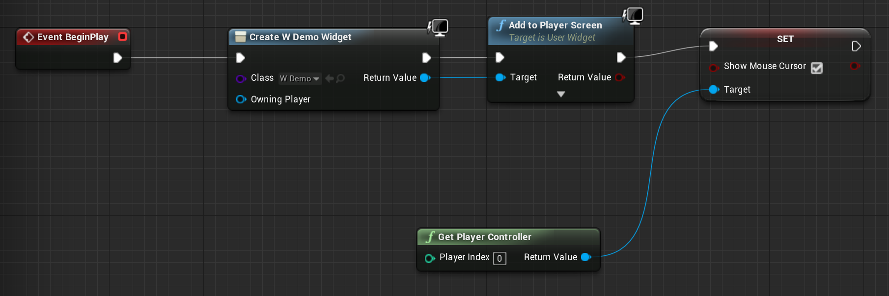
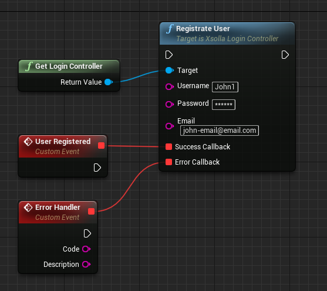
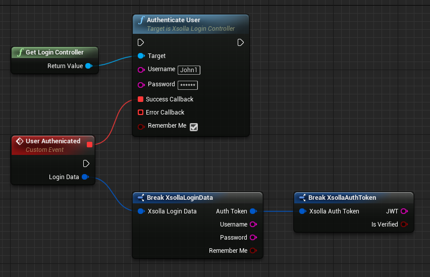
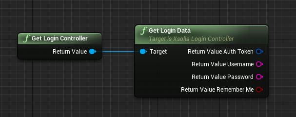
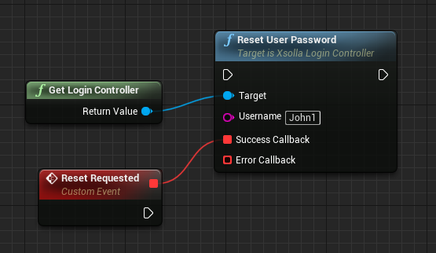

# xsolla-ue4-demo

# Xsolla Store SDK for Unreal Engine 4

Xsolla UE4 SDK is used to integrate [Xsolla Login API](https://developers.xsolla.com/api/v2/login/) and [Xsolla Store API](https://developers.xsolla.com/api/v2/store/) methods with apps based on the [Unreal Engine](https://www.unrealengine.com/).

This solution works only for:
* storing user data at Xsolla’s side
* authentication via email/username and password

Target OS:
* iOS
* Android
* Linux
* Mac OS
* Windows 32-bit
* Windows 64-bit

**Info:** The integration demo is available in the **Content** folder. It includes authorization interface and events processing already set up. **ДОПОЛНИТЬ ПРО МАГАЗИН** You can use it as an example.

## System Requirements

* 64-bit OS
* Windows 7 and higher
* Mac OS X 10.9.2 and higher
* Visual Studio 2017 and higher
* XCode 10.1 and higher for Mac OS
* Unreal Engine 4.22 and higher

## Integration Flow

1. Register an [Xsolla Publisher Account](https://publisher.xsolla.com).
2. [Create](#creating-a-project) a project in your Publisher Account.
3. [Set up](#setting-up-login) Login in your Publisher Account.
4. [Install and set up](#installing-and-setting-up-the-plugin) the plugin for the Unreal Engine project.
5. [Set up](#setting-up-events-processing) events processing.

### Creating a Project

1. Log in to [Publisher Account](http://publisher.xsolla.com).
2. Go to **Projects** and click **Create new project**.
3. In setup mode, add **Project name** and click **Create**.
4. Go to **Project settings** > **Integration settings** and check that **Tokenless integration** is disabled.

### Setting up Login

1. Create a new Login in your Publisher Account and specify the **Login name**.
2. Go to **General settings** > **URL**:
    1. Specify the **Callback URL** to redirect the user to after authentication.
    2. Select an **Xsolla storage** in the **User data storage** block.

### Setting up Store

**НАСТРОЙКА СТОРА НА СТОРОНЕ XSOLLA**

### Installing and Setting up the Plugin

1. To install the plugin from [Epic Games Launcher](https://www.epicgames.com/unrealtournament/download):
    1. Go to Epic Games Launcher > **Unreal Engine** > **Marketplace**.
    2. Find the **Xsolla** plugin and click **Install to Engine**.
2. To install the plugin from [GitHub](https://github.com/xsolla/store-ue4-sdk):
    1. Download the plugin from GitHub.
    2. Go to the folder of your UE project > **Plugins** and create the **Xsolla** folder.
    3. Unpack the archive with the plugin to the **Xsolla** folder.
3. Open your UE project in Unreal Editor.
4. Compile your UE project.
5. Go to the **Content Browser** and add a **New C++ Class** with the **None** parent node. *Required only for Blueprint projects with the plugin installed from GitHub.*
6. Go to **Settings** > **Plugins**:
    1. Find the **XsollaL** plugin.
    2. Tick the **Enabled** box.
    3. Click the **Restart now** button to save the settings.
7. Go to **Settings** > **Project Settings** > **Plugins** > **Xsolla Login** and fill in the Xsolla Login Settings as described below:

| Xsolla Login Settings | Description                                               |
| :---                  | :---                                                      |
|Login project ID       |Login ID from your Publisher Account. **Required.**        |
|Callback URL           |URL to redirect the user to after registration/authentication/password reset. Must be identical to the **Callback URL** specified in Publisher Account in Login settings. **Required if there are several Callback URLs.**|
|User data storage      |The storage to save user data to. Must be 'Xsolla storage'.|
|JWT validation URL     |Server URL to validate the JWT on your side. **Required** if you want to [validate JWT](#jwt-validation) additionally.|

8. Go to **Settings** > **Project Settings** > **Plugins** > **Xsolla Store** and fill in the Xsolla Store Settings as described below:

| Xsolla Store Settings     | Description                                               |
| :---                      | :---                                                      |
|Project ID                 |Project ID from your Publisher Account. **Required.**      |
|Sandbox                    |**НАПИСАТЬ ПРО РЕЖИМ ПЕСОЧНИЦЫ ПО ПЛАТЕЖАМ**               |
|Use Platform Browser       |If yes, external (system) browser will be launched to process payments|

### Setting up Events Processing

**Info:** Events are key actions that a user performs during the authentication process.

Processing of events is already set up in the integration demo. You can use it and change the settings appropriately:
* *If the plugin is installed from Epic Games Launcher*, open your UE project in Unreal Editor and go to **Xsolla Content** > **Demo** > **W_LoginWidget**.
* *If the plugin is installed from GitHub*, open your UE project in Unreal Editor and go to **Plugins** > **Xsolla** > **Content** > **Demo** > **W_LoginWidget**. 

**Note:** If you could not find the files mentioned above in Unreal Editor, go to **View Options** and tick the **Show Plugin Content** box.

To try the demo widget in the UE project:
1. Open your UE project in Unreal Editor.
2. Go to **Blueprints** > **Open Level Blueprint** and add nodes as shown in the picture below:

3. Compile the Blueprint/C++ class and play the level.

You can also use your own authorization interface and set up your own project’s events as follows: 
1. Open your UE project in Unreal Editor.
2. Add and design the interface for user authorization following [documentation](https://docs.unrealengine.com/en-us/Engine/UMG).
3. Open the authorization interface in the **Graph** view. 
4. Add and set up **Xsolla SDK nodes** described below.
5. Compile the Blueprint/C++ class and play the level.

## Xsolla Login SDK Nodes

#### Registrate User

Adds a new user to the database. 

*Input Data Pins*

| Name   | Type | Description           |
| :---   | :--- | :---                  |
|Username|string|Username. **Required.**|
|Password|string|Password. **Required.**|
|Email   |string|Email. **Required.**   |

*Output Data Pins*

| Name            | Description                                               |
| :---            | :---                                                      |
|Callback successful |Request to sign up the user is successfully sent. The user will receive an account confirmation [message](https://developers.xsolla.com/recipes/login/email-customization/) to the specified email.      |
|Callback failed   |Request to sign up the user is failed.                     |

<details><summary>Example</summary>
  </img>
</details>

#### Authenticate User

Authenticates the user by the username and password specified via authorization interface.

*Input Data Pins*

| Name         | Type  | Description                                                                |
| :---         | :---  | :---                                                                       |
|Username      |string |Username. **Required.**                                                     |
|Password      |string |Password. **Required.**                                                     |
|Remember me   |boolean|Whether the user agrees to save the authentication data. Default is 'false'.|

*Output Data Pins*

| Name            | Description                                               |
| :---            | :---                                                      |
|Callback successful |Request to authenticate the user is successfully sent. User data is saved to **XsollaLoginController**.|
|Callback failed   |Request to authenticate the user is failed.                |

<details><summary>Example</summary>
  </img>
</details>

#### Validate Token

Validates if the JWT generated for the successfully authenticated user is not expired.

*Output Data Pins*

| Name            | Description   |
| :---            | :---          |
|Callback successful |JWT is valid.  |
|Callback failed   |JWT is invalid.|

#### Get Login Controller

Gets **XsollaLoginController** to use the **Get Login Data** node. 

#### Get Login Data

Gets the data structure of the authenticated user from **XsollaLoginController**.

*Output Data Pins*

| Name                   | Description   |
| :---                   | :---          |
|Return JWT value        |Returns the value of the JWT generated for the successfully authenticated user.|
|Return username value   |Returns the value of the username inputted during authentication.|
|Return password value   |Returns the value of the password inputted during authentication.|
|Return remember me value|Returns the value of the **Remember me** checkbox ticked during authentication. If the checkbox is ticked, the user data will automatically be inserted to the authentication interface from cache.|

<details><summary>Example</summary>
  </img>
</details>

### Drop Login Data

Cleans the user data in **XsollaLoginController**.

#### Get Login Settings

Gets Xsolla Login Settings described in the [table](#installing-and-setting-up-the-plugin).

#### Reset User Password

Resets the user password. The user will receive a password change verification [message](https://developers.xsolla.com/recipes/login/email-customization/).

<details><summary>Example</summary>
  </img>
</details>

### JWT Validation

A [JWT](https://jwt.io/introduction/) is generated for each successfully authenticated user. This value is signed by the secret key encrypted according to the SHA-256 algorithm. You can set up JWT validation using Firebase. Follow the instructions below:
1. Create the [Firebase](https://firebase.google.com/) project.
2. Install [Node.JS](https://nodejs.org/en/).
3. Install the **firebase-tools** package:
```
$ npm install -g firebase-tools
```
**Note:** If the package could not get access to system files, try to reinstall Node.JS following the [instruction](https://treehouse.github.io/installation-guides/mac/node-mac.html).

4. Open console:
    1. *If the plugin is installed from Epic Games Launcher*, go to the folder with UE installed > **Engine** > **Plugins** > **Marketplace** > **XsollaLogin** > **Extras** > **TokenVerificator**.
    2. *If the plugin is installed from GitHub*, go to the UE project > **Plugins** > **XsollaLogin** > **Extras** > **TokenVerificator**. 
5. Run the following command: 
```
$ firebase login
```
6. Specify your Firebase authentication data in a browser.
7. Go back to the **TokenVerificator** folder, open the *.firebaserc* file, and check that the **Firebase Project ID** is correct. **Note:** If you could not find the *.firebaserc* file, set up the display of hidden files on your PC.
8. Go back to the **TokenVerificator** folder > **functions**.
    1. Open the *config.json* file and paste your secret key. You can find it in your **Publisher Account > Login settings > General settings**.  
    2. Install the xsolla-jwt script to the Firebase project:
    ```
    $ npm install
    $ npm run deploy
    ```
    3. Copy the URL from the console.
9. Open your UE project in Unreal Editor, go to **Settings** > **Project Settings** > **Plugins** > **Xsolla Login SDK** and paste the copied URL to the **JWT validation URL** field.

**Note:** Login SDK automatically validates and updates the JWT value on the Xsolla’s server. 


## Xsolla Store SDK Nodes

### REST API

#### UpdateVirtualItems

Update list of virtual items.


#### UpdateItemGroups

Update list of item groups
@param Locale (optional) Desired payment locale. Leave empty to use default value.


#### UpdateInventory

Update list of purchased virtual items
@param AuthToken User authorization token.


#### FetchPaymentToken

Initiate item purchase session and fetch token for payment console

     * @param AuthToken User authorization token.
     * @param ItemSKU Desired item SKU.
     * @param Currency (optional) Desired payment currency. Leave empty to use default value.
     * @param Country (optional) Desired payment country ISO code. Leave empty to use default value.
     * @param Locale (optional) Desired payment locale. Leave empty to use default value.


#### FetchCartPaymentToken

     * Initiate cart purchase session and fetch token for payment console

     * @param AuthToken User authorization token.
     * @param Currency (optional) Desired payment currency. Leave empty to use default value.
     * @param Country (optional) Desired payment country ISO code. Leave empty to use default value.
     * @param Locale (optional) Desired payment locale. Leave empty to use default value.


#### LaunchPaymentConsole
Open payment console for provided access token 
@param AuthToken User authorization token.

#### CheckOrder
Check pending order status
@param AuthToken User authorization token.
@param OrderId 

#### CreateCart
Create new cart
@param AuthToken User authorization token.

####  ClearCart
Remove all items from cart
@param AuthToken User authorization token.

#### UpdateCart
Update cart content
@param AuthToken User authorization token.

#### AddToCart
Add item to cart and change its quantity
@param AuthToken User authorization token.
 @param ItemSKU Desired item SKU.
  @param Quantity

#### RemoveFromCart
@param AuthToken User authorization token.
 @param ItemSKU Desired item SKU.
Remove item from cart


### Data access

#### GetVirtualItems
Get list of cached virtual items filtered by Category
@param GroupFilter
TArray<FStoreItem>

#### GetVirtualItemsWithoutGroup
Get list of cached virtual items without any Category provided

#### GetItemsData
Get cached items data

#### GetCart
Get cached cart data

#### GetInventory
Get cached inventory data

#### GetPendingPaystationUrl
Get pending paystation url to be opened in browser

#### GetCurrencyLibrary
Get currency-format data table